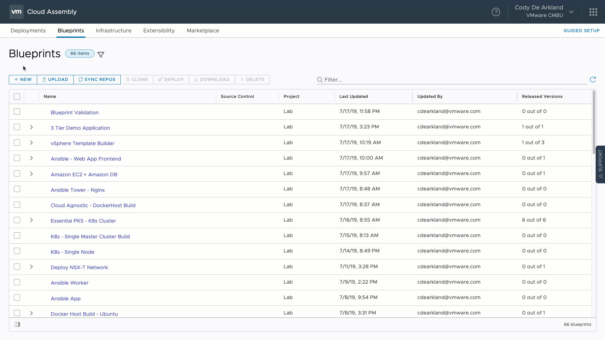
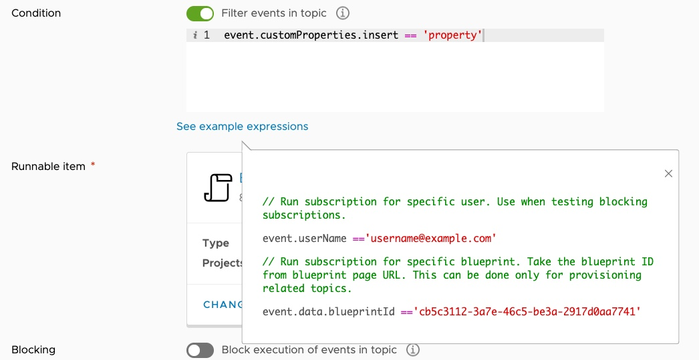

Lab 07. Implementing Extensibility
**********************************

Cloud Automation Services allows users to extend the functionality of their deployments by way of 2 constructs **Action Based Extensibility (ABX)** or **vRealize Orchestrator**

These extensibility objects are executed by way of the **Event Broker** service which ties common machine and deployment lifecycle states to workflows or actions that should be executed.

A common path to extensibility involves working with the custom deployments within a blueprint. To get started with this lab, we'll clone our **Basic IaaS** to anew blueprint named **Basic IaaS with Extensibility**. If you don't want to clone - sample blueprint content is below

Sample YAML
===========

.. code-block:: yaml
   :linenos:

    formatVersion: 1
    inputs: {}
    resources:
      Cloud_Machine_1:
      type: Cloud.Machine
      properties:
        image: #TODO configure your cloud image
        flavor: #TODO configure your flavor
        constraints:
          - tag: #TODO configure your constraints for the cloud you are deploying to

Extensibility Types
===================

Before we get started with actually consuming extensibility, let's level set on what the paths forward are 

vRealize Orchestrator 
---------------------

Able to deployed through as an appliance that can be downloaded and bound to an environment the **integrations** tab allows users to access and consume workflows to drive automation. These workflows are primarilly developed in JavaScript and can be leveraged with a wide plugin ecosystem to integrate with many external platforms (Infoblox, Pure, etc...)

Action Based Extensibility (ABX)
--------------------------------

Integrated directly into Cloud Automation Services and enables users to leverage Function as a Service to drive automation against an environment. These functions can be crafted in either Python3  or NodeJS (JavaScript) currently, and execute against AWS Lambda or Azure Functions. 

Accessing Properties with ABX
=============================

1. Navigate to the **Extensibility** tab in Cloud Assembly 
2. Select **Actions**
3. Select **New Action**
4. Name our new Action and select a Project to bind it to 

You'll be placed into an editor for Python. Here we can directly code our function as a service. Replace the code that exists within the code editor window with the code below

Sample Action - Print Properties
=======================================

.. code-block:: python
    :linenos:

    import json

    def handler(context, inputs):
        print(json.dumps(inputs, indent=2))

5. Select the Amazon Web Services FaaS provider on the right 
6. Select Save and Test 
7. Observe the results
8. Close the editor

Can you add more input values and test again? 

Can you add additional words to the text that returns? 

Creating  Event Subscriptions
=============================

1. Select **Subscriptions**
2. Select **New Subscription** 
3. Provide a name for the Subscription
4. Select an Event Topic (Suggestion: **Compute post provision**) 
5. Select our Runnable Item (**Blueprint Properties**)
6. Select **Create** 
7. Deploy a workload from the blueprints interface 
8. Return to the **Extensibility** screen and select **Action Runs** to observe executions 

.. image:: ../_static/property-print.gif

This creates a subscription that will run against all compute provisioning events and will print all properties associated with the provisioning action. 

Adding a New Custom Property
============================

1. Navigate to Blueprints and select your **Basic IaaS with Extensibility** blueprint
2. Under **properties** add a new key value pair

Sample YAML - Add a Property
============================

.. code-block:: yaml
   :linenos:
   :emphasize-lines: 9

    formatVersion: 1
    inputs: {}
    resources:
      Cloud_Machine_1:
      type: Cloud.Machine
      properties:
        image: 'ubuntu'
        flavor: 'medium'
        insert: 'property' #TODO configure your own custom property
        constraints:
          - tag: 'env:aws'

3. Deploy your blueprint again, and observe the ABX run again. Can you see your property in the output? Can you chnage the code to show only the ``customProperties`` field?

Filtering Execution of Extensibility
====================================

It's common that you may only want to execute an extensibility action/workflow if a specific property is present on your blueprint. For this example, we'll assume you have left ``insert: property`` on the blueprint as the example above shows. 

1. Naviage back to **Extensibility**
2. Select **Subscriptions**
3. Select your Property Printing subscription
4. Enable the **"Filter events in topic"** Condition toggle 
5. Using JavaScript dot syntanx, enter ``event.customPropertes.insert == 'property'`` as the filter. This will enable the subscription to only run when the indicated value is present (property in this case)

6. Select **Save**
7. Execute your blueprint deployment again. Does it run the extensibility action? Remove your property and try again. What about now?

Challenge
=========

1. There are a number of "pre-canned" ABX actions available. Can you configure the rename blueprint to change the name of your machine deployments? Experiment with blocking tasks. 

2. Can you execute a REST API call to the Star Wars API? (https://swapi.co)?

Further Reading
===============

1. `Learn more about extensibility actions <https://docs.vmware.com/en/VMware-Cloud-Assembly/services/Using-and-Managing/GUID-55847415-5920-47E7-86BD-20CD9EB6BA6B.html>`__

2. `How do I configure a virtual machine IP address using extensibility actions <https://docs.vmware.com/en/VMware-Cloud-Assembly/services/Using-and-Managing/GUID-C0650275-3E76-4BF5-ADC5-3B86C571DBB1.html>`__

3. `Extensibility workflow subscriptions <https://docs.vmware.com/en/VMware-Cloud-Assembly/services/Using-and-Managing/GUID-59FB9E70-FC14-4689-99EE-8B078DD744B7.html>`__