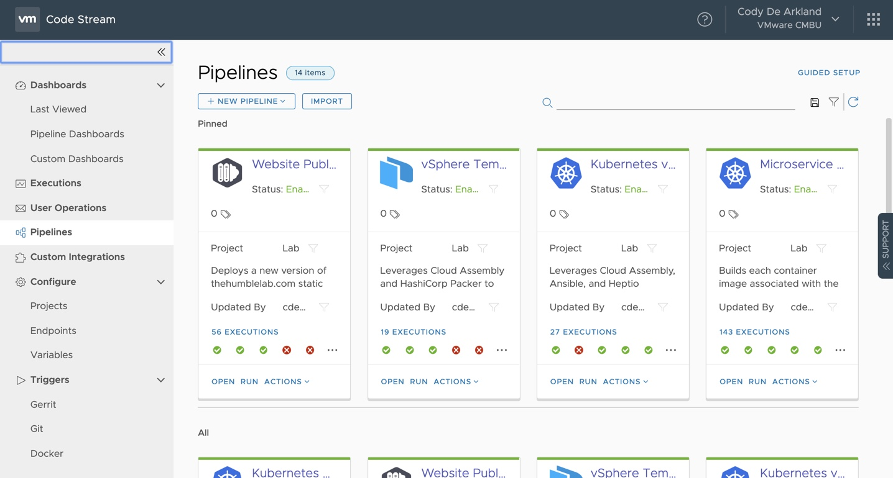
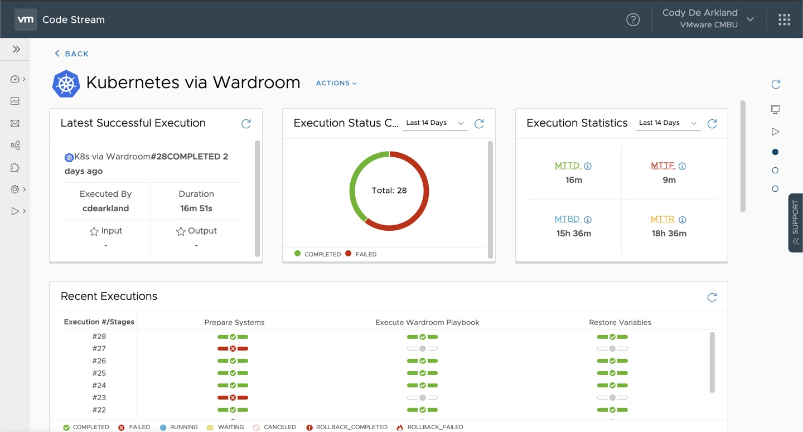
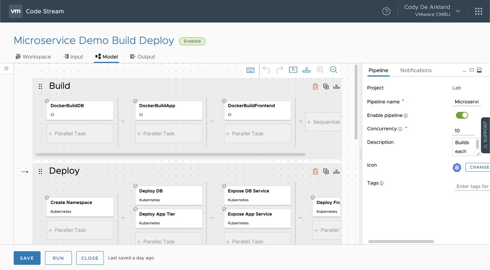
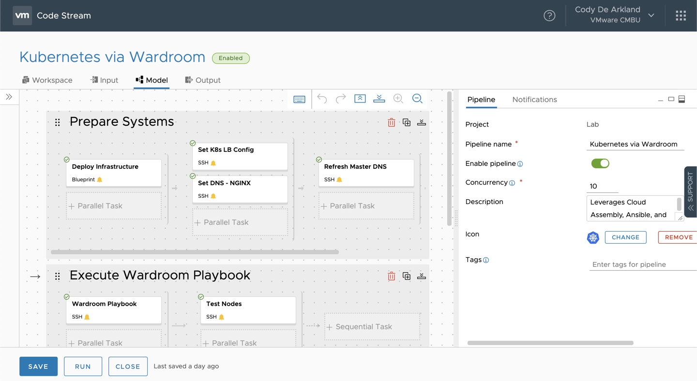

Lab 08. Pipelines and Code Stream
*********************************

.. note:: This module functions different from previous modules due to the nature of Code Stream and its flexibility as a delivery tool for pipeline driven automation. As such, this module will be less about the steps to implement a functional pipeline at this time, and more of a technology overview

Code Stream provides users the ability to create pipeline driven automation. Code Stream relies an an extensive **Endpoint** ecosystem to provide interaction to other systems. These systems include platforms like Git, Jenkins, vRealize Orchestrator, SSH, Kubernetes and many others. 

As Pipelines execute, job information is automatically captured and placed into integrated Dashboards that capture common metrics around pipeline executions 

Endpoint Types
==============

Agent
-----
The **Agent** endpoint leverages an on-premises Cloud Proxy appliance to act as an agent for interacting with other on premises environments. These could be Remote SSH commands or REST calls as an example. 

Artifactory
-----------
Artifactory is a platform focused on storage and consumption of software artifacts. These artifacts are typically results of build processes or application binaries. 

Bamboo
------
Bamboo is a Continuous Integration (CI) platform made by Atlassian. It focuses on software/application build processes. Code Stream can leverage this endpoint to execute the CI process jobs. 

Docker
------
The Docker endpoint allows Code Stream to spin up Docker images to assist with Pipeline's via the Workspace. These images are referred to as **Builder Images**. These builder's can be used to build other Docker images, or interact with common CLI based tools (i.e. AWS CLI) during Code Stream tasks. 

Docker Registry
---------------
This endpoint allows access to a private Docker Registry for pulling images as part of the Builder Workspace from the previous **Docker** object type. Private Registries can be used to pull non-public images as part of pipeline processes. 

Email
-----
The email endpoint allows Code Stream to intract with an email platform for delivering notification tasks during pipelines. 

Git
---
The Git endpoint supports GitHub, GitLab, and BitBucket On-Premises and SaaS platforms for bringing code into a pipeline. This endpoint also allows the ability to setup Git based triggers for pipeline execution. 

Jenkins
-------
Allows Code Stream to execute Jenkins jobs as part of a defined pipeline task 

Jira
----
Allows Code Stream to open Jira tags as part of a pipeline 

Kubernetes
----------
Allows Code Stream to interact with a Kubernetes cluster as part of the deployment. This includes CRUD operations against a Kubernetes endpoint (apply, delete, etc...). 

PCF
---
Allows Code Stream to interact with a Pivotal Cloud Foundery endpoint for building and pushing software 

TFS
---
Allows Code Stream to access code from Team Foundation Server in a Code Stream pipeline 

vRealize Orchestrator
---------------------
Allows Code Stream to execute vRealize Orchestrator workflows as part of a pipeline. 

Pipeline Types
==============

When we talk about pipelines in Code Stream, we typically refer to either **Infrastructure** pipelines or **Software Delivery** pipelines (traditional CI/CD). 

Software Delivery Pipelines
---------------------------

Software delivery pipelines are typically focused on delivering compiled applications or content onto an existing platform - such as Kubernetes. These pipelines commonly leverage Git integration to pull down sofware source code and build / deploy / and test the desired application stack. 

An example of this is in the screenshot above, where this pipeline builds container images, delivers those images onto a Kubernetes cluster, and then runs a series of tests against the application to ensure a successful deployment of the platform. 

Infrastructure Pipelines
------------------------

Infrastructrue pipelines most commonly interact with infrastructure deployment platforms, for example the native integration with Cloud Assembly. These pipelines rely on configuration management platforms like Ansible, Chef, or Puppet to deliver infastructure configuration - and then leverage CI/CD methodologies to drive testing against these components. 

An example of this is captured in the screenshot above where Cloud Assembly deploys a set of infrastructure leveraging its integration with Ansible. Remote SSH commands are leveraged to connect to the workloads and configure the items. 

Pipeline Triggers
=================

Git
---
This trigger allows pipelines to execute based off a push or pull request to a Git repository. This allows automated execution of pipelines based off code commit. 

Docker
------
This trigger allows pipelines to execute as Docker images are pushed into a Docker registry. 

Gerrit
------
This trigger allows pipelines to execute after code is checked into a Gerrit server. 
